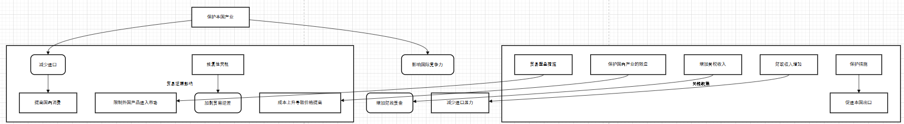
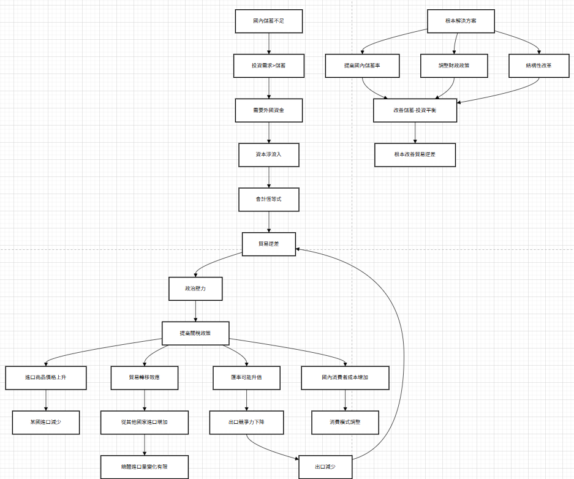

# 📖 我也有自己的AI! 來看看效果吧!

*比較日期: 2025/08/03*  
*目標: 在預設為qwen2.5:7b下，實驗天模式和摘要模式的效果*

---

## 🎯 聊天模式

### 🚀 提問
	考慮 doggiAI 沒有和世界新關聯動，我準備了關稅相關問題
	1. 你對關稅政策有什麼理解?
	2. 為什麼關稅議題會和貿易逆差有關係? 這個關係有什麼因果或邏輯可循?
	3. 你能夠畫一個關聯圖, 例如用SVG 或 Mermaid語做圖

### 💡 第一輪對話串模式
	使用方式和平日與我其他AI好夥伴一樣一問一答，結果：
	*(1) 回答雖說人模人樣，但是對於 typo error 沒有辦法抓到意圖（應該是因為沒記憶）*
	*(2) 會認真回答問題，但是對於對話串中的互動需要提示才能做出對的答案。*
	可以看到打錯字會出現幻覺，也可以看到他無法在問句之間串接。

	> 	1. 你對關稅政策有什麼理解?

	关税政策是指一国政府为了调节国际贸易、保护本国产业和增加财政收入等目的，对进出境的货物和服务征收的一种税收。关税是国家宏观调控经济的重要手段之一。

	了解关税政策可以从以下几个方面来考虑：

	贸易平衡：通过调整关税，可以影响进出口商品的数量，进而调节国内市场的供需关系，促进贸易顺差或逆差的改善。
	保护本国产业：对于一些重要的或者处于发展初期的产业，政府可能会采取提高进口商品关税的方式保护这些产业免受外国竞争的影响。
	增加财政收入：通过征收关税，可以为政府提供额外的资金来源。这对于维护国家经济稳定具有重要作用。
	国际关系与合作：关税政策也是国家间贸易谈判的重要内容之一。在多边或双边的贸易协议中，关税往往成为讨论的核心问题。
	了解关税的具体操作时，还需要注意以下几点：

	关税税率会因不同的商品类别而不同；
	不同的商品可能适用不同的关税类型（如从量税、从价税等）；
	特定条件下可以享受减免或豁免关税的待遇（比如某些特定出口产品或农产品可能会有免税政策）。
	总之，关税政策是一个复杂但又非常重要的经济和政治议题。它不仅对国家内部市场有着直接影响，也是国际经贸关系中的关键因素之一。

🤖 qwen2.5:7b | ⏱️ 14.98秒 🟡

	> 2. 為什麼閱稅議題會和貿易逆差有關係? 這個關係有什麼因果或邏輯可循?

	阅读税议题通常与贸易逆差有一定的联系，这主要是因为贸易政策、税收政策等宏观经济因素之间存在着一定的相互影响。以下是这种关系的逻辑和因果分析：

	贸易逆差的影响：贸易逆差指的是一个国家进口的商品和服务超过了出口的数量。持续性的贸易逆差可能导致国内制造业竞争力下降等问题。

	阅读税的作用机制：

	消费导向调整：阅读税通常是对书籍、杂志等文化产品征收的间接税收，其主要目标是调节特定商品或服务的市场需求。
	影响进口和出口平衡：如果政府对某些外国出版物（特别是高利润的进口出版物）实施较高的阅读税，这可能会增加这些产品的成本，从而减少消费者的购买意愿，有助于降低对国外文化产品的需求。同时，这也可能鼓励国内生产更多的本土出版物，提升本土文化的自信心。
	间接影响贸易逆差：

	如果一个国家征收了高阅读税，尤其是针对外国进口书籍等文化商品的阅读税，则可能会导致这些进口商品的价格上升，从而降低其相对于国内产品的竞争力。这会减少消费者对进口商品的需求量。
	同时，增加本土出版物和文化创意产业的发展也会吸引一部分原本可能用于购买进口文化产品（包括书籍、音乐、电影等）的资金转向支持本国的文化产业。这样，在长期内有助于改善贸易逆差的情况。
	复杂性与局限性：

	需要注意的是，阅读税对整体贸易结构的影响相对有限，并不能从根本上解决长期性的结构性贸易失衡问题。
	除此之外，提高某些特定商品的进口成本可能会导致替代效应或其他市场反应，影响经济的整体平衡和效率。
	综上所述，虽然直接针对文化产品征收的阅读税不会直接影响到所有的进出口商品和服务项目，但它可以在一定程度上改变消费偏好、促进国内文化产业的发展，并间接地对贸易逆差产生一定的正面作用。然而，这种措施通常只是宏观调控策略中的一个组成部分，其效果需结合其它政策手段共同评估和优化。

🤖 qwen2.5:7b | ⏱️ 12.17秒 🟡

	> 3. 你能夠畫一個關聯圖, 例如用SVG 或 Mermaid語做圖

	當然可以！我可以幫助你使用Mermaid语言来绘制一个简单的关联图。首先，你需要确保你的环境支持Mermaid。这里我将直接在文本中展示Mermaid代码和生成的图表。

	下面是一个简单的例子：

	```
	graph LR;
    A[Person] --> B[Company];
    C[Product] --> D[Market];
    B --> E[Investor];
    C --> F[Customer];
    ```

	解释一下这段代码：

	A[Person] 定义了一个节点，名字为 "Person"。
	--> 表示方向上的关系（箭头所指的方向）。
	用这种方式，我们可以画出多个节点之间的联系。
	你可以尝试修改这个简单的例子或增加更多的节点和连线来满足你的需求。下面是一个扩展的例子：

	```
	graph LR;
    A[Person] --> B[Company];
    C[Product] --> D[Market];
    B --> E[Investor];
    C --> F[Customer];

    B --> G[Suppliers];
    B --> H[Employees];
    ```

	这个图展示了一个公司与其周围的各种关系。你可以将Mermaid代码复制到支持Mermaid的在线编辑器或工具中进行预览和调整。

	如果你想要直接在文本中查看生成的图表，这里会是一个SVG格式的内容示例（请注意实际输出可能需要特定的HTML环境来显示）：

	<svg width="142" height="176" viewBox="0 0 142 176" xmlns="http://www.w3.org/2000/svg">
    	<!-- 基础图形元素将会在这里生成 -->
	</svg>

	请尝试在支持Mermaid的环境中运行上述代码，如GitHub Flavored Markdown（gfm）页面。如果你有具体的需求，请告诉我！

🤖 qwen2.5:7b | ⏱️ 11.54秒 🟡


### 💡 第二輸先跟他概述我想做的事，再一次給他問題
	必需給自己一個開心，這樣的結果好多了，只不過不是個貼心的好AI。

	> 我將詢問你幾個關稅相關的問題，請看完全部問題再一一回覆我。如果你回話有長度限制，那就請分次回，如果需要我為你喊繼續請跟我說。你準備好了嗎?

	我已经准备好了，请您开始提问吧。您可以告诉我需要继续吗？我会随时等待您的问题。

🤖 qwen2.5:7b | ⏱️ 6.68秒 🟡

	> 你對關稅政策有什麼理解?
	為什麼關稅議題會和貿易逆差有關係? 這個關係有什麼因果或邏輯可循?
	你能夠畫一個關聯圖協助說明, 例如用SVG 或 Mermaid格式。
	1. 关税政策的理解
	关税是一种贸易壁垒措施，政府通过征收进出口商品的税费来调节经济和保护本国产业。具体来说：

	增加收入：关税可以为国家提供财政收入。
	保护国内产业：提高进口商品的成本以减少对本国产品的竞争。
	调控市场：调整市场价格和供需关系。
	促进出口：通过退税政策等措施支持本国产品出口。
	2. 关税与贸易逆差的关系
	关税可能会导致贸易逆差增加，原因如下：

	提高进口成本：关税使进口商品的价格上升，可能导致国内消费者转向购买国内产品，从而减少对外国产品的进口需求。

	限制外国产品进入市场：较高的关税可能阻止国外商品进入国内市场，限制了外国企业向本国出口的机会。

	保护的效应：当某些行业受到保护时，这些行业的成本可能会增加，导致最终产品价格上升。这可能会进一步影响消费者选择。

	报复措施：一个国家提高关税可能导致其他国家采取相应的反制措施，通过提高针对该国商品的进口关税来平衡贸易逆差。这种互相加征关税的行为可能加剧整体贸易逆差问题。

	3. 关税政策与贸易逆差的关系图
	以下是使用Mermaid格式绘制的一个简化的关联图：
```
graph TD;
    A[保护本国产业] --> B(减少进口);
    B(减少进口) --> C[提高国内消费];
    D[增加关税收入] --> E(增加财政资金);
    F[贸易壁垒措施] --> G[限制外国产品进入市场];
    H[报复性关税] --> I(加剧贸易逆差);
    J[保护国内产业的效应] --> K[成本上升导致价格提高];
    L[保护措施] --> M[促进本国出口];
    N[财政收入增加] --> O[减少进口压力];
    A --> P(影响国际竞争力);

    subgraph 关税政策
        D
        F
        J
        L
        M
        N
    end

    subgraph 贸易逆差影响
        B
        C
        G
        H
        I
        K
    end
```
	这个关联图展示了关税政策如何通过多种途径间接导致贸易逆差问题。每一箭头表示因果关系或逻辑联系，帮助理解复杂的关系网络。希望这个解释能为您提供帮助！

🤖 qwen2.5:7b | ⏱️ 14.74秒 🟡

## 🎯 和老師比一比....
	 
	 

